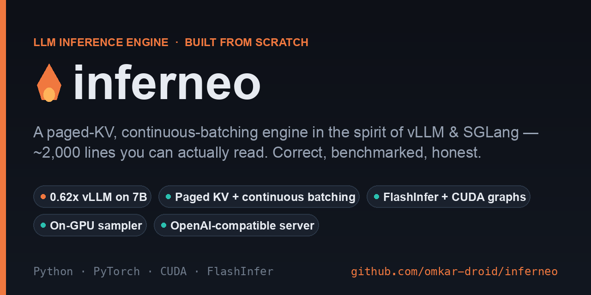

<div align="center">



# 🔥 Inferneo

**A small, readable, paged-KV LLM inference engine — in the spirit of vLLM and SGLang.**

Real continuous batching · paged KV cache · FlashInfer · an OpenAI-compatible server · honest benchmarks.

</div>

---

Inferneo is an LLM serving engine you can actually read. The whole core is ~2,000 lines,
organized so that a scheduling, KV-cache, or disaggregation idea from a paper is a small
diff — not a fork of a 500k-line production system.

It is built around one idea, borrowed from vLLM's V1 engine: **a request is just its token
ids plus a count of how many have been computed.** There is no "prefill phase" and no
"decode phase" — every step, a token-budget scheduler decides how many tokens to run for
each request, and prefill / decode / chunked-prefill all fall out of that automatically.

> **Positioning, stated honestly.** Inferneo does not claim to beat vLLM on throughput —
> vLLM has years of kernel and CUDA-graph work behind it. Inferneo claims to be
> **understandable, correct, and measurable**. Greedy output matches HuggingFace
> token-for-token, and every benchmark here shows the vLLM number on the same hardware,
> even when inferneo loses.

## Features

- **Paged KV cache + continuous batching** with chunked prefill and preemption under memory pressure.
- **Unified token-budget scheduler** (vLLM-V1 style) — no prefill/decode phase split.
- **Priority scheduling (preemptive)** — a `priority` field admits interactive requests ahead of a
  queued batch backlog, and when every slot is full it *evicts* the lowest-priority running job
  (strict-inequality eviction, so no thrashing). In a fully-saturated engine, an urgent request's
  time-to-first-token drops from blocked-indefinitely to 1 step.
- **Model-general, not Llama-only** — Llama 2/3, TinyLlama, Mistral, **Qwen2.5, Qwen3** load from
  HuggingFace safetensors directly. The engine is architecture-agnostic; a new family is a registry
  entry plus (at most) a small attention subclass — Qwen2 is "Llama + qkv bias", Qwen3 adds per-head
  QK-norm, each ~4 lines. Verified token-for-token vs HuggingFace.
- **Multimodal**: LLaVA vision support — a CLIP tower + projector produce image embeddings that are
  spliced into the token sequence, so the paged KV cache, scheduler and CUDA graphs treat an image
  as just rows in the sequence. OpenAI multimodal message content is accepted as-is.
- **Long-context RoPE scaling**: YaRN, linear, and Llama-3 scaling — `inv_freq` matches HuggingFace
  to 0.0, so models extended past their trained window (Qwen2.5, DeepSeek, long-context fine-tunes)
  serve correctly instead of being refused.
- **Pluggable attention backends**: a pure-torch SDPA reference that runs on **CPU / MPS / CUDA**,
  and a **FlashInfer** fast path auto-selected on CUDA.
- **Hash-chain prefix caching** for shared prompts (opt-in).
- **Fully on-GPU batched sampler**: temperature, top-k / top-p / min-p, presence / frequency /
  repetition penalties, seeds, and logprobs — one device pass, no CPU round-trip.
- **CUDA graphs** on the decode step — captured per batch-size bucket, ~2.3× faster decode.
- **torch.compile** fuses the decode forward's pointwise ops (small buckets only) — ~37% lower
  single-stream latency, captured inside the CUDA graph.
- **OpenAI-compatible server**: `/v1/completions` and `/v1/chat/completions` with SSE streaming.
- **Torch-free control plane** — the scheduler and KV manager import without torch, so they
  run in CPU CI and stay hackable and backend-portable.

## Install

```bash
pip install -e ".[dev]"          # core + tests, runs on CPU/MPS
pip install -e ".[dev,cuda]"     # adds FlashInfer for the CUDA fast path
```

Python ≥ 3.10, PyTorch ≥ 2.4. No GPU required to develop — the SDPA backend runs everywhere.

## Quick start

### Offline

```python
from inferneo import LLM, SamplingParams

llm = LLM("TinyLlama/TinyLlama-1.1B-Chat-v1.0")     # device auto: cuda > mps > cpu
outs = llm.generate(
    ["The capital of France is"],
    SamplingParams(max_tokens=32, temperature=0.7),
)
print(outs[0].outputs[0].text)
```

### As an OpenAI-compatible server

```bash
inferneo serve --model TinyLlama/TinyLlama-1.1B-Chat-v1.0 --port 8000
```

```bash
curl http://localhost:8000/v1/chat/completions \
  -H 'Content-Type: application/json' \
  -d '{
    "model": "tinyllama",
    "messages": [{"role": "user", "content": "Name three primary colors."}],
    "stream": true
  }'
```

It speaks the OpenAI wire format, so existing clients work unchanged:

```python
from openai import OpenAI

client = OpenAI(base_url="http://localhost:8000/v1", api_key="none")
resp = client.chat.completions.create(
    model="tinyllama",
    messages=[{"role": "user", "content": "Hello!"}],
)
print(resp.choices[0].message.content)
```

## Architecture

Three planes, separated by a strict rule — **which files may import torch**:

```
                 ┌─────────────────────────────────────────────┐
  HTTP request → │  SERVING PLANE   inferneo/server/            │  FastAPI · SSE
                 │  OpenAI API · async engine · EngineClient    │
                 └───────────────┬─────────────────────────────┘
                    add_request ↓   ↑ RequestOutput
                 ┌───────────────┴─────────────────────────────┐
                 │  CONTROL PLANE   inferneo/engine/  inferneo/kv/   ← NO torch
                 │  token-budget scheduler · block manager ·    │
                 │  prefix cache · preemption · step loop       │
                 └───────────────┬─────────────────────────────┘
              SchedulerOutput ↓   ↑ ModelRunnerOutput   (ids + ints, serializable)
                 ┌───────────────┴─────────────────────────────┐
                 │  TENSOR PLANE    executor/ attention/        │  PyTorch · CUDA
                 │  models/ sampling/                           │
                 │  flat varlen batch · paged attention · sample│
                 └─────────────────────────────────────────────┘
```

- **Control plane** (`inferneo/engine/`, `inferneo/kv/`) — pure Python, **no torch imports**
  (enforced by a test). The scheduler emits `{request: num_tokens}` under a token budget; the
  KV manager owns block tables, hash-chain prefix caching, and preemption. This is the part you
  edit to try a research idea.
- **Tensor plane** (`inferneo/executor/`, `attention/`, `models/`, `sampling/`) — PyTorch.
  All scheduled tokens run in one flat, unpadded batch; paged attention resolves each token's
  KV via block tables; there's a single GPU→CPU sync per step.
- **Serving plane** (`inferneo/server/`) — FastAPI, talking to the engine only through an
  `EngineClient` seam, so the in-process engine can later become a separate process untouched.

The step loop: `schedule() → execute() → update() → stream outputs`.

## Benchmarks

Honest measurement only — same GPU, same model, same dtype, warmed, with vLLM shown alongside.

**Offline throughput vs vLLM 0.24.0** — H100 NVL · fp16 · 200 ragged (64–256 token) requests:

| Model | inferneo | vLLM | ratio |
|---|---:|---:|---:|
| **Mistral-7B-Instruct-v0.2** | **8,216 tok/s** | 13,222 tok/s | **0.62×** |
| TinyLlama-1.1B | 18,900 tok/s | 47,094 tok/s | 0.40× |

On a real 7B model inferneo reaches **0.62× of vLLM** — the tiny model is the worst case
(fixed per-step overhead dominates; decode is latency-bound). The remaining gap is host
overhead and kernel fusion, not correctness. Full methodology and the serving-latency
(TTFT/TPOT) + prefix-caching numbers: [benchmarks/README.md](benchmarks/README.md).

## Correctness

**Inferneo computes the same thing the reference does.** Greedy decoding matches HuggingFace
token-for-token — verified across single requests, ragged batches, chunked prefill,
preemption-and-resume, and prefix caching, on both a tiny random model (CPU, exact) and real
TinyLlama-1.1B. On CUDA, the FlashInfer backend is cross-checked against the SDPA reference.
The vision path matches HuggingFace LLaVA token-for-token on a real image (14/14 tokens), and
RoPE scaling (YaRN / linear / Llama-3) matches HF's `inv_freq` exactly.

```bash
pytest                      # unit (torch-free) + correctness vs HF + e2e HTTP, CPU only
pytest -m gpu               # FlashInfer-vs-reference cross-check (needs a GPU)
```

## Layout

```
inferneo/
  engine/      scheduler.py · engine.py · request.py · llm.py · async_engine.py   (control plane, no torch)
  kv/          block_pool.py · block_manager.py · hashing.py                       (control plane, no torch)
  executor/    torch_runner.py                                                     (tensor plane)
  attention/   sdpa_backend.py · flashinfer_backend.py · selector.py
  models/      llama.py · layers.py · loader.py · registry.py
  sampling/    sampler.py        tokenizer/       server/  (OpenAI API)
tests/         unit (torch-free) · correctness (vs HF) · e2e (HTTP)
benchmarks/    baselines/hf_padded_engine.py · offline_throughput.py
examples/      offline_inference.py
```

## License

Apache-2.0.
