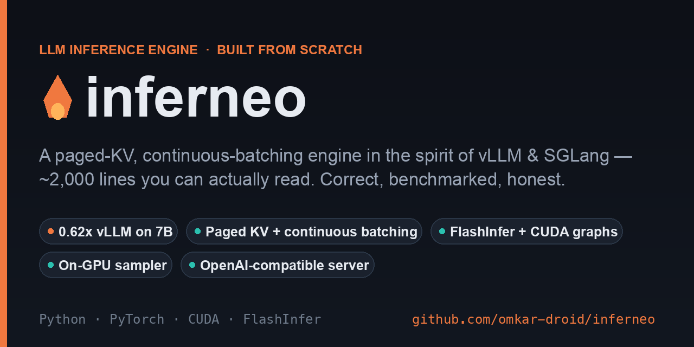
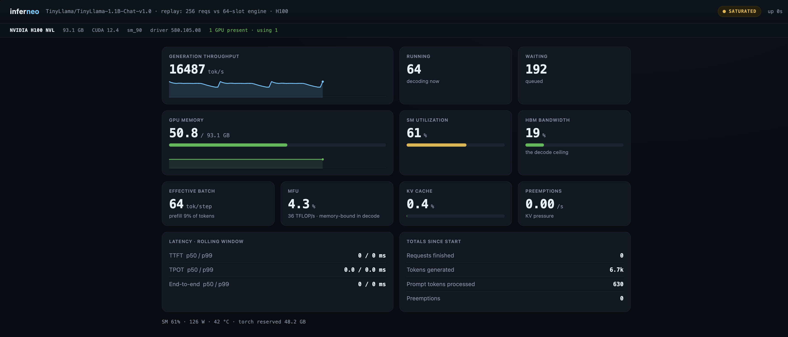

<div align="center">



# 🔥 Inferneo

**A complete LLM inference engine, built from scratch — the vLLM / SGLang serving stack in ~2,000 lines you can actually read.**

Paged KV · continuous batching · chunked prefill · CUDA graphs · FlashInfer · priority preemption · 8 model families · an OpenAI-compatible server · a live dashboard — every output verified token-for-token against HuggingFace.

<p>
<a href="https://github.com/omkar-droid/inferneo/actions/workflows/ci.yml"></a>


</p>

</div>

---

Inferneo implements the architecture behind modern inference servers — a unified
token-budget scheduler over a paged KV cache, the design at the heart of vLLM's V1 engine —
from scratch, in a core small enough to read in an afternoon. It's a real engine, not a toy:
continuous batching, chunked prefill, hash-chain prefix caching, CUDA graphs, an on-GPU
sampler, eight model families across genuinely different architectures, multimodal vision,
and an OpenAI-compatible server — all sitting on a **torch-free control plane you can edit
without touching a kernel**.

It's built around one idea, borrowed from vLLM's V1 engine: **a request is just its token
ids plus a count of how many have been computed.** There is no "prefill phase" and no
"decode phase" — every step, a token-budget scheduler decides how many tokens to run for
each request, and prefill / decode / chunked-prefill all fall out of that automatically.

## Where inferneo fits

vLLM and inferneo are different kinds of project, and the comparison only makes sense once
that's clear. **vLLM** is a production serving system with years of kernel engineering and
100+ supported models — if you're deploying at scale, use it. **Inferneo** implements the
same core ideas for a different goal: being small enough to *understand and modify*. Both run
the modern stack — paged KV, a V1-style scheduler, chunked prefill, prefix caching, CUDA
graphs, FlashInfer — so the real question is what you get to *do* with it:

| | vLLM | inferneo |
|---|---|---|
| Raw throughput (7B, single H100) | **1.0× — fastest** | 0.62× |
| Model coverage | **100+ architectures** | 8 families, each verified vs HF |
| Core size | large production codebase | **~2,000 readable lines** |
| Scheduler + KV manager | torch-coupled | **torch-free · ~300 lines · CPU-testable** |
| A new scheduling idea is… | a fork | **a small diff** |
| Best for | **production deployment** | **learning the engine, research** |

Reaching **0.62× of vLLM's throughput on a 7B model — from a core you can read in an
afternoon, built solo — is the result that matters**: the architecture is right, and the
remaining gap is mechanical (kernel fusion, CUDA-graph coverage), not fundamental or a
correctness compromise. Every benchmark below shows the vLLM number on the same hardware.

## Live dashboard

<p align="center">

</p>

The built-in **`/dashboard`** is a single self-contained page — no Prometheus, no Grafana — that
polls `/stats` and shows GPU identity, throughput, **HBM + SM utilization**, **MFU**, effective
batch, KV-cache occupancy, running-vs-waiting, and TTFT/TPOT percentiles. Above, it's replaying a
real H100 capture: **256 requests against a 64-slot engine at the saturated moment.** The story it
tells is the useful one — MFU 4.3% *and* HBM 19% at batch 64 means the GPU is neither compute- nor
memory-bound, i.e. **latency-bound**, which is exactly the regime CUDA graphs target. A `/metrics`
endpoint is exposed alongside for anyone who'd rather scrape it into Grafana.

## Features

- **Paged KV cache + continuous batching** with chunked prefill and preemption under memory pressure.
- **Unified token-budget scheduler** (vLLM-V1 style) — no prefill/decode phase split.
- **Priority scheduling (preemptive)** — a `priority` field admits interactive requests ahead of a
  queued batch backlog, and when every slot is full it *evicts* the lowest-priority running job
  (strict-inequality eviction, so no thrashing). In a fully-saturated engine, an urgent request's
  time-to-first-token drops from blocked-indefinitely to 1 step.
- **Model-general, across genuinely different architectures** — Llama 2/3, TinyLlama, Mistral,
  Qwen2.5, Qwen3, and now **GPT-2, Gemma, and Phi** load from HuggingFace safetensors directly. This
  isn't "Llama with small tweaks": GPT-2 has *no* RoPE (learned absolute positions) and LayerNorm;
  Phi uses partial-rotary RoPE and a parallel attention+MLP block; Gemma uses GeGLU, a `(1+weight)`
  RMSNorm, and √hidden embedding scaling. The engine (paged KV, scheduler, CUDA graphs, sampler)
  is unchanged across all of them — a new family is a registry entry plus a small model file.
  Verified token-for-token vs HuggingFace (GPT-2 and Phi-2 exact on the real checkpoints; every
  family greedy-identical to HF on the CPU correctness suite).
- **Live observability, zero infra** — a self-contained dashboard at `/dashboard` polls `/stats` and
  shows GPU memory + SM utilization (via NVML), KV-cache occupancy, running vs waiting requests,
  generation tok/s, and TTFT/TPOT percentiles — no Prometheus or Grafana required. A `/metrics`
  endpoint is exposed alongside for those who *do* want to scrape it into Grafana. The collector is
  torch-free; GPU numbers come from an injected probe, so it stays testable on CPU.
- **Multimodal**: LLaVA vision support — a CLIP tower + projector produce image embeddings that are
  spliced into the token sequence, so the paged KV cache, scheduler and CUDA graphs treat an image
  as just rows in the sequence. OpenAI multimodal message content is accepted as-is.
- **Long-context RoPE scaling**: YaRN, linear, and Llama-3 scaling — `inv_freq` matches HuggingFace
  to 0.0, so models extended past their trained window (Qwen2.5, DeepSeek, long-context fine-tunes)
  serve correctly instead of being refused.
- **Pluggable attention backends**: a pure-torch SDPA reference that runs on **CPU / MPS / CUDA**,
  and a **FlashInfer** fast path auto-selected on CUDA.
- **Hash-chain prefix caching** for shared prompts (opt-in).
- **Fully on-GPU batched sampler**: temperature, top-k / top-p / min-p, presence / frequency /
  repetition penalties, seeds, and logprobs — one device pass, no CPU round-trip.
- **CUDA graphs** on the decode step — captured per batch-size bucket, ~2.3× faster decode.
- **torch.compile** fuses the decode forward's pointwise ops (small buckets only) — ~37% lower
  single-stream latency, captured inside the CUDA graph.
- **OpenAI-compatible server**: `/v1/completions` and `/v1/chat/completions` with SSE streaming.
- **Torch-free control plane** — the scheduler and KV manager import without torch, so they
  run in CPU CI and stay hackable and backend-portable.

## Install

```bash
pip install -e ".[dev]"          # core + tests, runs on CPU/MPS
pip install -e ".[dev,cuda]"     # adds FlashInfer for the CUDA fast path
```

Python ≥ 3.10, PyTorch ≥ 2.4. No GPU required to develop — the SDPA backend runs everywhere.

## Quick start

### Offline

```python
from inferneo import LLM, SamplingParams

llm = LLM("TinyLlama/TinyLlama-1.1B-Chat-v1.0")     # device auto: cuda > mps > cpu
outs = llm.generate(
    ["The capital of France is"],
    SamplingParams(max_tokens=32, temperature=0.7),
)
print(outs[0].outputs[0].text)
```

### As an OpenAI-compatible server

```bash
inferneo serve --model TinyLlama/TinyLlama-1.1B-Chat-v1.0 --port 8000
```

```bash
curl http://localhost:8000/v1/chat/completions \
  -H 'Content-Type: application/json' \
  -d '{
    "model": "tinyllama",
    "messages": [{"role": "user", "content": "Name three primary colors."}],
    "stream": true
  }'
```

It speaks the OpenAI wire format, so existing clients work unchanged:

```python
from openai import OpenAI

client = OpenAI(base_url="http://localhost:8000/v1", api_key="none")
resp = client.chat.completions.create(
    model="tinyllama",
    messages=[{"role": "user", "content": "Hello!"}],
)
print(resp.choices[0].message.content)
```

## Architecture

Three planes, separated by a strict rule — **which files may import torch**:

```
                 ┌─────────────────────────────────────────────┐
  HTTP request → │  SERVING PLANE   inferneo/server/            │  FastAPI · SSE
                 │  OpenAI API · async engine · EngineClient    │
                 └───────────────┬─────────────────────────────┘
                    add_request ↓   ↑ RequestOutput
                 ┌───────────────┴─────────────────────────────┐
                 │  CONTROL PLANE   inferneo/engine/  inferneo/kv/   ← NO torch
                 │  token-budget scheduler · block manager ·    │
                 │  prefix cache · preemption · step loop       │
                 └───────────────┬─────────────────────────────┘
              SchedulerOutput ↓   ↑ ModelRunnerOutput   (ids + ints, serializable)
                 ┌───────────────┴─────────────────────────────┐
                 │  TENSOR PLANE    executor/ attention/        │  PyTorch · CUDA
                 │  models/ sampling/                           │
                 │  flat varlen batch · paged attention · sample│
                 └─────────────────────────────────────────────┘
```

- **Control plane** (`inferneo/engine/`, `inferneo/kv/`) — pure Python, **no torch imports**
  (enforced by a test). The scheduler emits `{request: num_tokens}` under a token budget; the
  KV manager owns block tables, hash-chain prefix caching, and preemption. This is the part you
  edit to try a research idea.
- **Tensor plane** (`inferneo/executor/`, `attention/`, `models/`, `sampling/`) — PyTorch.
  All scheduled tokens run in one flat, unpadded batch; paged attention resolves each token's
  KV via block tables; there's a single GPU→CPU sync per step.
- **Serving plane** (`inferneo/server/`) — FastAPI, talking to the engine only through an
  `EngineClient` seam, so the in-process engine can later become a separate process untouched.

The step loop: `schedule() → execute() → update() → stream outputs`.

## Benchmarks

Honest measurement only — same GPU, same model, same dtype, warmed, with vLLM shown alongside.

**Offline throughput vs vLLM 0.24.0** — H100 NVL · fp16 · 200 ragged (64–256 token) requests:

| Model | inferneo | vLLM | ratio |
|---|---:|---:|---:|
| **Mistral-7B-Instruct-v0.2** | **8,216 tok/s** | 13,222 tok/s | **0.62×** |
| TinyLlama-1.1B | 18,900 tok/s | 47,094 tok/s | 0.40× |

On a real 7B model inferneo reaches **62% of a production engine's throughput** — from a
core you can read in an afternoon. The gap is known, mechanical engineering (kernel fusion
and CUDA-graph coverage that years of vLLM work bought), not a design or correctness limit;
the profiler shows decode is latency-bound (low MFU *and* low HBM utilization), which is why
CUDA graphs already bought 2.3×. The tiny model is the worst case: fixed per-step overhead
dominates. Full methodology and the serving-latency (TTFT/TPOT) + prefix-caching numbers:
[benchmarks/README.md](benchmarks/README.md).

## Correctness

**Inferneo computes the same thing the reference does.** Greedy decoding matches HuggingFace
token-for-token — verified across single requests, ragged batches, chunked prefill,
preemption-and-resume, and prefix caching, on both a tiny random model (CPU, exact) and real
TinyLlama-1.1B. On CUDA, the FlashInfer backend is cross-checked against the SDPA reference.
The vision path matches HuggingFace LLaVA token-for-token on a real image (14/14 tokens), and
RoPE scaling (YaRN / linear / Llama-3) matches HF's `inv_freq` exactly.

```bash
pytest                      # unit (torch-free) + correctness vs HF + e2e HTTP, CPU only
pytest -m gpu               # FlashInfer-vs-reference cross-check (needs a GPU)
```

## Layout

```
inferneo/
  engine/      scheduler.py · engine.py · request.py · llm.py · async_engine.py   (control plane, no torch)
  kv/          block_pool.py · block_manager.py · hashing.py                       (control plane, no torch)
  executor/    torch_runner.py                                                     (tensor plane)
  attention/   sdpa_backend.py · flashinfer_backend.py · selector.py
  models/      llama.py · qwen.py · gemma.py · phi.py · gpt2.py · layers.py · loader.py · registry.py
  sampling/    sampler.py        tokenizer/       server/  (OpenAI API + /dashboard)
  metrics/     stats.py                                                          (control plane)
tests/         unit (torch-free) · correctness (vs HF) · e2e (HTTP)
benchmarks/    baselines/hf_padded_engine.py · offline_throughput.py
examples/      offline_inference.py
```

## Related projects

Inferneo runs its attention through FlashInfer's kernels — these two repos are where I build
and benchmark that same math *from scratch*, one kernel at a time:

- **[llm-cuda-kernels](https://github.com/omkar-droid/llm-cuda-kernels)** — hand-written CUDA
  for the ops inside a Llama forward pass (SiLU, RMSNorm, LayerNorm, a working FlashAttention),
  each built up from a naive version, optimized against the bottleneck it exposes, and
  benchmarked honestly on an H100 with a correctness check.
- **[cuda-softmax-worklog](https://github.com/omkar-droid/cuda-softmax-worklog)** — a deep dive
  on a single kernel: softmax, iterated from naive to 58% of peak HBM bandwidth, beating
  `torch.softmax`.

Inferneo is the engine; those are the kernels underneath it.

## License

Apache-2.0.
